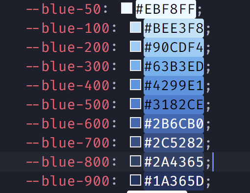

# PPV Components Design System

This design system is to help build UI components faster and keep the design consistent throughout the application. The goal of this system is to make our components modular and easy to maintain.


<details open>
  <summary><em>Table of Contents</em></summary>
  <ol>
   <li>
      <a href="#sizes">Sizes</a>
   </li>
    <li>
      <a href="#colors">Colors</a>
      <ul>
        <li><a href="#built-with">Backgroound-Color</a></li>
        <li><a href="#built-with">Color</a></li>
      </ul>
    </li>
    <li><a href="#shadows">Shadows</a></li>
    <li><a href="#border radius">Border radius</a></li>
    <li><a href="#flex box">Flex box</a></li>
    <li><a href="#grid">Grid</a></li>
    <li><a href="#margin">Margin</a></li>
    <li><a href="#padding">Padding</a></li>
    <li><a href="#typography">Typography</a></li>
    <li><a href="#animations">Animation</a></li>
    <li><a href="#containers">Containers</a></li>
  </ol>
</details>

# Sizes

### Main Sizes
<table>
   <thead>
      <tr>
         <th>Variable</th>
         <th>Size</th>
      </tr>
   </thead>
   <tbody>
      <tr>
         <td>--xs</td>
         <td>0.15rem</td>
      </tr>
      <tr>
         <td>--s</td>
         <td>0.5rem</td>
      </tr>
      <tr>
         <td>--m</td>
         <td>0.5rem</td>
      </tr>
      <tr>
         <td>--l</td>
         <td>0.75rem</td>
      </tr>
      <tr>
         <td>--xl</td>
         <td>1rem</td>
      </tr>
      <tr>
         <td>--xxl</td>
         <td>1.5rem</td>
      </tr>
   </tbody>
</table>

### Size Range


The range starts at **xs** which is the smallest value and ends at **xxl** which is the largest value.

### Uses
use as a **varaible**
_⚠ Use **margin** helper classes instead_
```css
.my-element{
   margin-top: var(--xs);
   /*same as*/
   margin-top: 0.15rem;
}

```

---

# Colors

### Main Colors and Shades 
- Grey
- Blue
- Red
- Purple
- Pink
- Cyan
- Orange 
- Yellow
- Teal
- Green

### Color Range

The last number at the end of a color class/variable is the range.
The range starts at **50** which is the lightest value and ends at **900** which is the darkest value.
Lighter ⏭ Darker
ColorName-**50** - ColorName-**900**

### Color Range Example


### Uses (Background)
use as a **varaible**
```css
.my-element{
   background: var(--blue-500);
}
```
use as a **class**
```html
<div class="bg-blue-500"></div>
```
### Uses (Color)
use as a **varaible**
```css
h1{
  color : var(--blue-500);
}
```
use as a **class**
```html
<h1 class="blue-500"></h1>
```

---
# Shadows


### Shadow Range

The range starts at **xs** which is the lightest value and ends at **xxl** which is the darkest value.
Lighter ⏭ Darker
shadow-**xs** - shadow-**xxl**

### Uses
use as a **varaible** (_not recommended_)
```css
.my-element{
   box-shadow: var(--shadow-xs);
}
```
use as a **class**
```html
<div class="shadow-xs"></div>
```

---
# Border radius


### Border radius Range

The range starts at **xs** which is the smallest value and ends at **xxl** which is the largest value.

rounded-**xs** ⏭ rounded-**xxl**

### Uses
use as a **varaible** (_not recommended_)
```css
.my-element{
   border-radius: var(--rounded-xs);
}
```
use as a **class**
```html
<div class="rounded-xs"></div>
```

**For fully rounded _(border-radius: 50%; )_**
use:
```html
   <div class="rounded"></div>
```

---
# Flex Box

- ### Flex (Horizontal)

```html
<div class="flex"></div>
<!---Same as--->
<div class="flex-h"></div>
```

- ### Flex (Vertical)

```html
<div class="flex-v"></div>
<!---Same as--->
<div class="flex-column"></div>
```

- ### Align items (Vertical)

Options:
- center
- top
- bottom (baseline)
  
```html
<div class="align-center"></div>
<div class="align-top"></div>
<div class="align-bottom"></div>

```
- ### Justify content (Horizontal)

Options:
- center
- space-between
- space-around
- baseline
- space-evenly
  
```html
<div class="justify-center"></div>
<div class="justify-between"></div>
<div class="justify-around"></div>
<div class="justify-baseline"></div>
<div class="justify-evenly"></div>

```
- ### Gap
  
#### Gap range

The range starts at **xs** which is the smallest value and ends at **xxl** which is the largest value.

gap-**xs** ⏭ gap-**xxl**

use as a **varaible** (_not recommended_)
```css
.my-flex-element{
   gap: var(--gap-xs);
}
```
use as a **class**
```html
<div class="flex gap-xs"></div>
```
  
---

# Margin


### Margin Range

The range starts at **xs** which is the smallest value and ends at **xxl** which is the largest value.

m-**xs** ⏭ m-**xxl**

### Uses
use as a **varaible** (_not recommended_)
```css
.my-element{
   margin: var(--m-xs);
}
```
use as a **class**
```html
<div class="m-xs"></div>
```

- #### Margin Horizonal (left - right)  

use as a **class**

```html
   <div class="mx-xs"></div>
```
- #### Margin Vertically (top - bottom)  

use as a **class**

```html
   <div class="my-xs"></div>
```
- #### Margin Left  

use as a **class**

```html
   <div class="ml-xs"></div>
```
- #### Margin Right  

use as a **class**

```html
   <div class="mr-xs"></div>
```
- #### Margin Top  

use as a **class**

```html
   <div class="mt-xs"></div>
```
- #### Margin Bottom  

use as a **class**

```html
   <div class="mb-xs"></div>
```

---
# Padding


### Padding Range

The range starts at **xs** which is the smallest value and ends at **xxl** which is the largest value.

m-**xs** ⏭ m-**xxl**

### Uses
use as a **varaible** (_not recommended_)
```css
.my-element{
   padding: var(--p-xs);
}
```
use as a **class**
```html
<div class="p-xs"></div>
```

- #### Padding Horizonal (left - right)  

use as a **class**

```html
   <div class="px-xs"></div>
```
- #### Padding Vertically (top - bottom)  

use as a **class**

```html
   <div class="py-xs"></div>
```
- #### Padding Left  

use as a **class**

```html
   <div class="pl-xs"></div>
```
- #### Padding Right  

use as a **class**

```html
   <div class="pr-xs"></div>
```
- #### Padding Top  

use as a **class**

```html
   <div class="pt-xs"></div>
```
- #### Padding Bottom  

use as a **class**

```html
   <div class="pb-xs"></div>
```

---
# Typography

**Sizes:**
<table>
   <thead>
      <tr>
         <th>Variable</th>
         <th>Size</th>
      </tr>
   </thead>
   <tbody>
      <tr>
         <td>--xs</td>
         <td>0.75rem</td>
      </tr>
      <tr>
         <td>--s</td>
         <td>0.875rem</td>
      </tr>
      <tr>
         <td>--m</td>
         <td>1rem</td>
      </tr>
      <tr>
         <td>--l</td>
         <td>1.125rem</td>
      </tr>
      <tr>
         <td>--xl</td>
         <td>1.25rem</td>
      </tr>
      <tr>
         <td>--xxl</td>
         <td>1.5rem</td>
      </tr>
      <tr>
         <td>--xxxl</td>
         <td>2rem-5rem</td>
      </tr>
   </tbody>
</table>

**Options:**
- bold
- center
- underline

The range starts at **xs** which is the smallest value and ends at **xxl** which is the largest value.

m-**xs** ⏭ m-**xxl**

### Uses
use as a **varaible** (_not recommended_)
```css
p{
   font-size: var(--font-xl);
}
```
use as a **class**
```html
<p class="font-xl bold"></p>
<p class="font-xl underline"></p>
<p class="font-xl center"></p>
<p class="font-xl center underline bold">I am bold underlined and centered</p>
```


---
# Animations

- animateIn (fades in from top)
- animateOut (Fade out)

### Uses

use as a **class**
```html
<p class="animateIn">I will fade in from top</p>

```
# Containers

### Uses

use as a **class**
```html
<section class="container"></section>

```


---